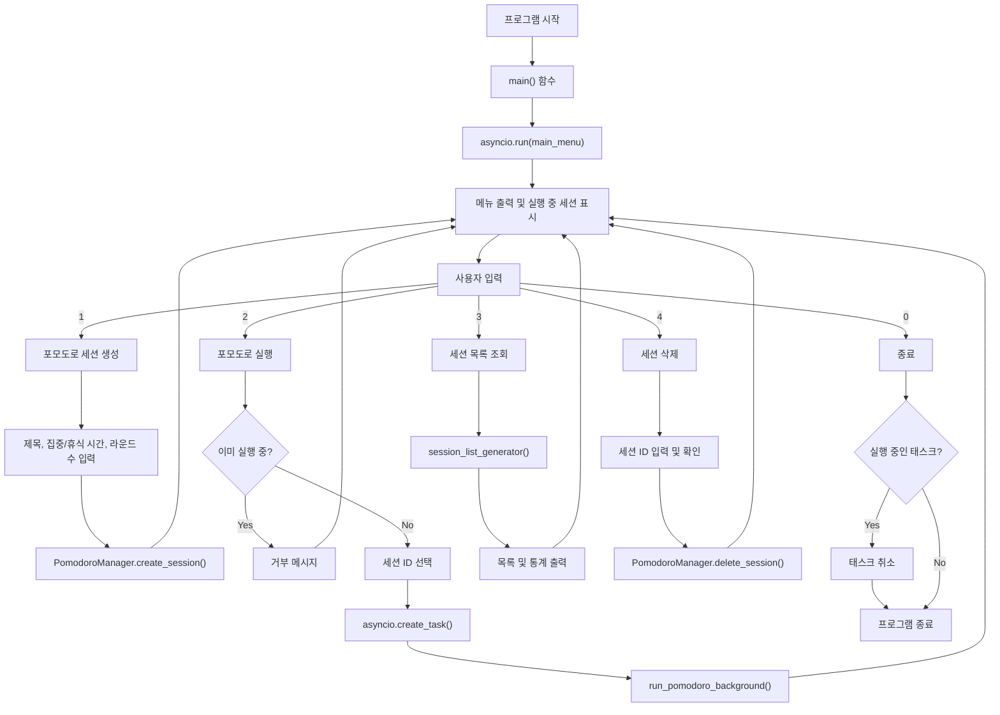
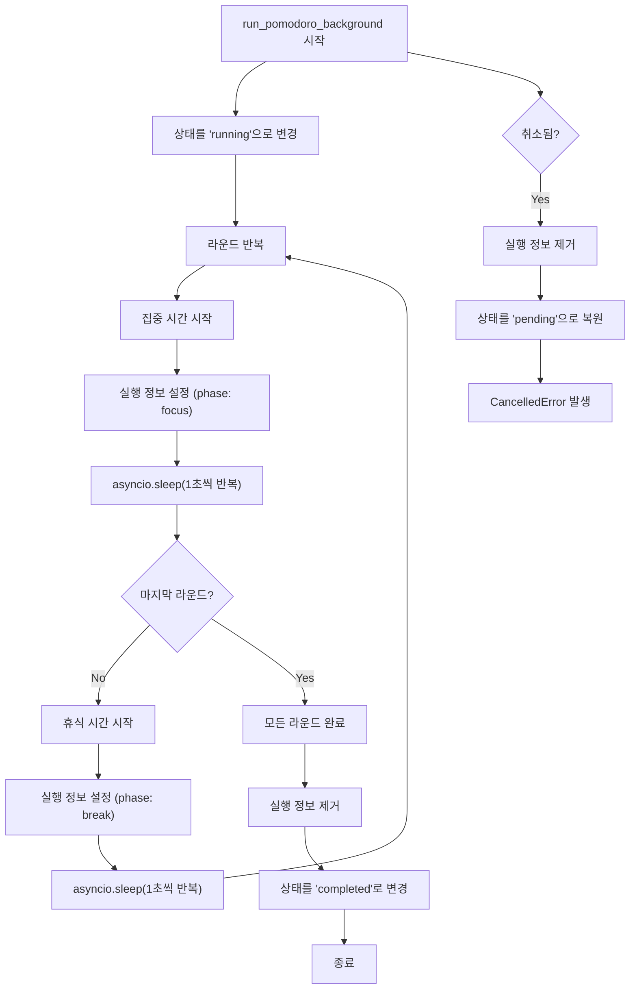
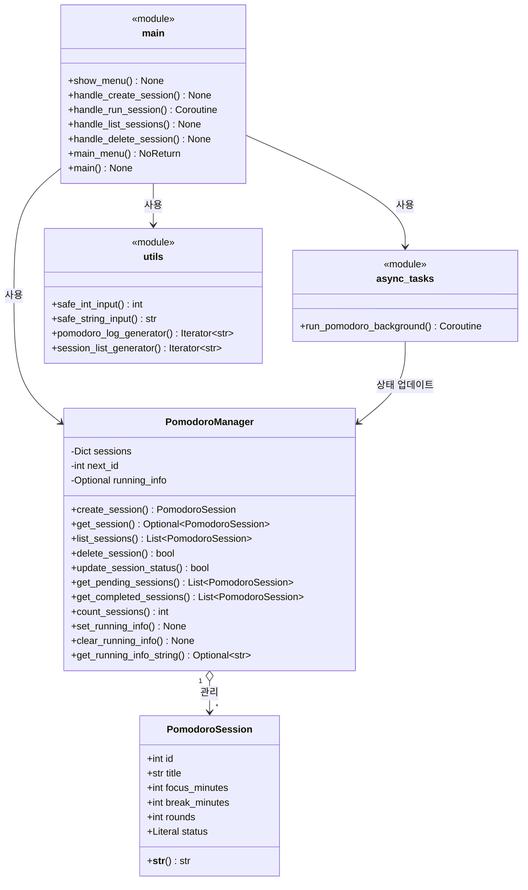

# 프로그램 순서도

## 메인 실행 흐름

```mermaid
flowchart TD
    Start[프로그램 시작] --> Main["main() 함수"]
    Main --> AsyncRun["asyncio.run(main_menu)"]
    AsyncRun --> Menu[메뉴 출력 및 실행 중 세션 표시]
    Menu --> Input[사용자 입력]
    
    Input -->|"1"| Create[포모도로 세션 생성]
    Create --> CreateInput[제목, 집중/휴식 시간, 라운드 수 입력]
    CreateInput --> CreateSession["PomodoroManager.create_session()"]
    CreateSession --> Menu
    
    Input -->|"2"| Run[포모도로 실행]
    Run --> CheckRunning{이미 실행 중?}
    CheckRunning -->|Yes| Reject[거부 메시지]
    Reject --> Menu
    CheckRunning -->|No| SelectSession[세션 ID 선택]
    SelectSession --> CreateTask["asyncio.create_task()"]
    CreateTask --> Background["run_pomodoro_background()"]
    Background --> Menu
    
    Input -->|"3"| List[세션 목록 조회]
    List --> Generator["session_list_generator()"]
    Generator --> Display[목록 및 통계 출력]
    Display --> Menu
    
    Input -->|"4"| Delete[세션 삭제]
    Delete --> DeleteInput[세션 ID 입력 및 확인]
    DeleteInput --> DeleteSession["PomodoroManager.delete_session()"]
    DeleteSession --> Menu
    
    Input -->|"0"| Exit[종료]
    Exit --> Cleanup{실행 중인 태스크?}
    Cleanup -->|Yes| Cancel[태스크 취소]
    Cancel --> End[프로그램 종료]
    Cleanup -->|No| End
```

## 백그라운드 포모도로 실행 흐름

```mermaid
flowchart TD
    Start[run_pomodoro_background 시작] --> SetRunning["상태를 'running'으로 변경"]
    SetRunning --> Loop[라운드 반복]
    
    Loop --> Focus[집중 시간 시작]
    Focus --> SetFocusInfo["실행 정보 설정 (phase: focus)"]
    SetFocusInfo --> FocusWait["asyncio.sleep(1초씩 반복)"]
    FocusWait --> LastRound{마지막 라운드?}
    
    LastRound -->|No| Break[휴식 시간 시작]
    Break --> SetBreakInfo["실행 정보 설정 (phase: break)"]
    SetBreakInfo --> BreakWait["asyncio.sleep(1초씩 반복)"]
    BreakWait --> Loop
    
    LastRound -->|Yes| Complete[모든 라운드 완료]
    Complete --> ClearInfo[실행 정보 제거]
    ClearInfo --> SetCompleted["상태를 'completed'로 변경"]
    SetCompleted --> End[종료]
    
    Start --> Cancelled{취소됨?}
    Cancelled -->|Yes| ClearInfo2[실행 정보 제거]
    ClearInfo2 --> SetPending["상태를 'pending'으로 복원"]
    SetPending --> Raise[CancelledError 발생]
```

## 클래스 다이어그램

```mermaid
classDiagram
    class PomodoroSession {
        +int id
        +str title
        +int focus_minutes
        +int break_minutes
        +int rounds
        +Literal status
        +__str__() str
    }

    class PomodoroManager {
        -Dict sessions
        -int next_id
        -Optional running_info
        +create_session() PomodoroSession
        +get_session() Optional~PomodoroSession~
        +list_sessions() List~PomodoroSession~
        +delete_session() bool
        +update_session_status() bool
        +get_pending_sessions() List~PomodoroSession~
        +get_completed_sessions() List~PomodoroSession~
        +count_sessions() int
        +set_running_info() None
        +clear_running_info() None
        +get_running_info_string() Optional~str~
    }

    class async_tasks {
        <<module>>
        +run_pomodoro_background() Coroutine
    }

    class utils {
        <<module>>
        +safe_int_input() int
        +safe_string_input() str
        +pomodoro_log_generator() Iterator~str~
        +session_list_generator() Iterator~str~
    }

    class main {
        <<module>>
        +show_menu() None
        +handle_create_session() None
        +handle_run_session() Coroutine
        +handle_list_sessions() None
        +handle_delete_session() None
        +main_menu() NoReturn
        +main() None
    }

    PomodoroManager "1" o--> "*" PomodoroSession : 관리
    main --> PomodoroManager : 사용
    main --> async_tasks : 사용
    main --> utils : 사용
    async_tasks --> PomodoroManager : 상태 업데이트
```
