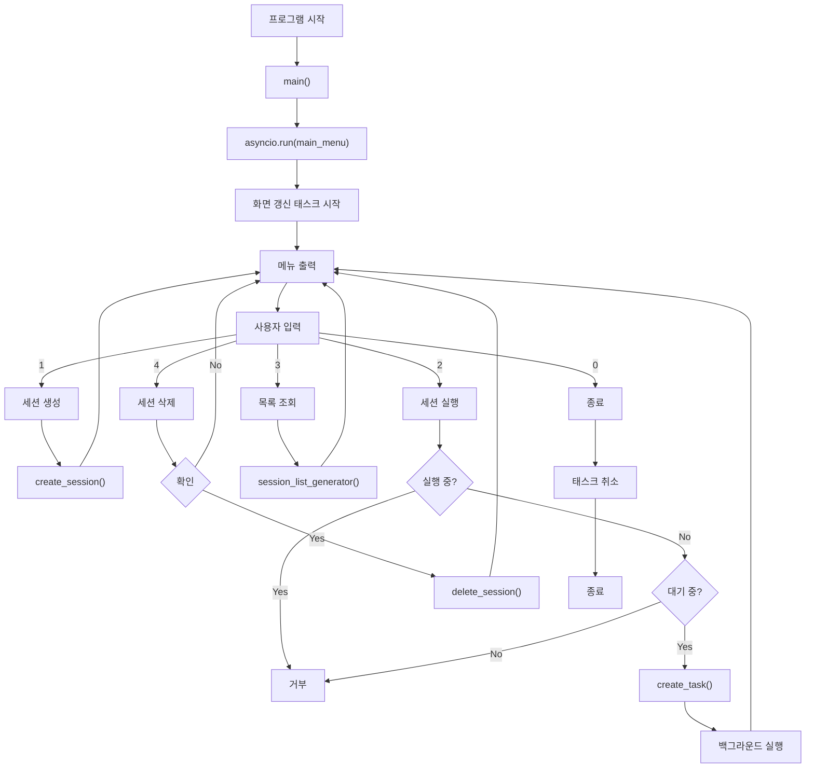
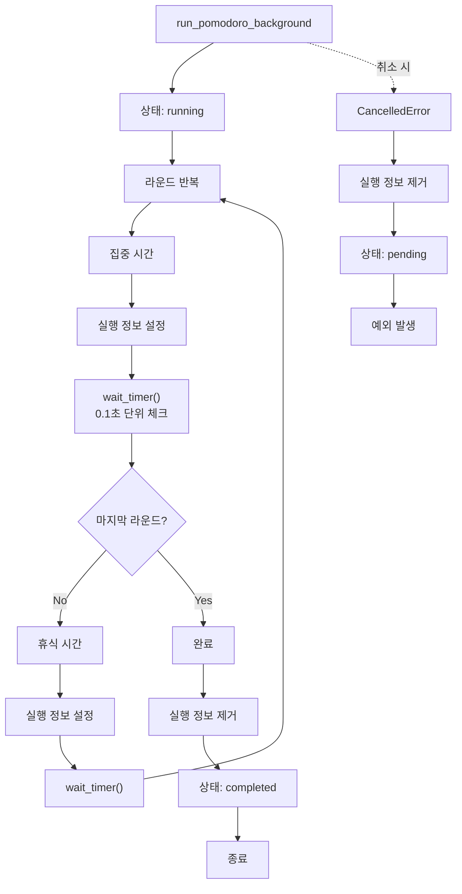
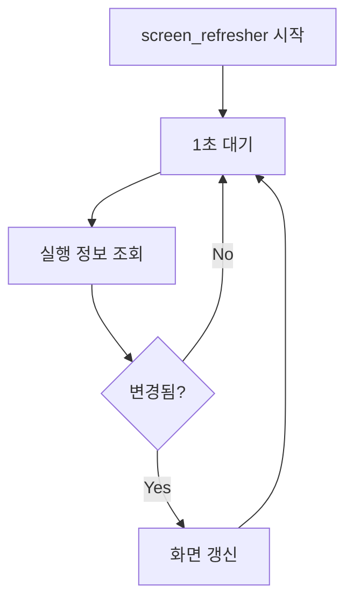
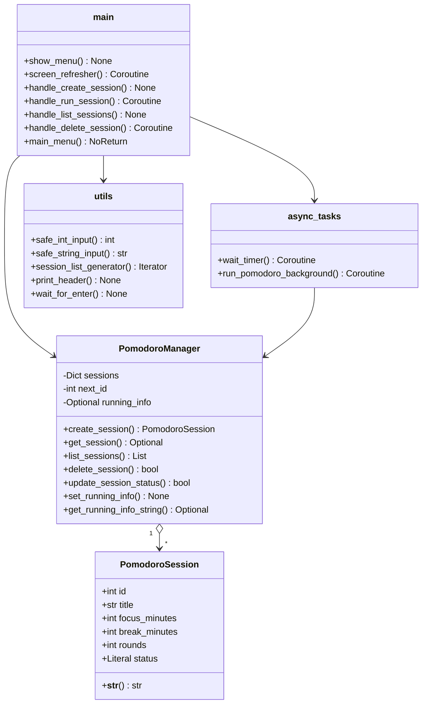

# 프로그램 순서도

## 메인 실행 흐름

```mermaid
flowchart TD
    Start[프로그램 시작] --> Main["main()"]
    Main --> AsyncRun["asyncio.run(main_menu)"]
    AsyncRun --> RefreshTask[화면 갱신 태스크 시작]
    RefreshTask --> Menu[메뉴 출력]
    Menu --> Input[사용자 입력]
    
    Input -->|"1"| Create[세션 생성]
    Create --> CreateSession["create_session()"]
    CreateSession --> Menu
    
    Input -->|"2"| Run[세션 실행]
    Run --> CheckRunning{실행 중?}
    CheckRunning -->|Yes| Reject[거부]
    CheckRunning -->|No| CheckPending{대기 중?}
    CheckPending -->|No| Reject
    CheckPending -->|Yes| CreateTask["create_task()"]
    CreateTask --> Background[백그라운드 실행]
    Background --> Menu
    
    Input -->|"3"| List[목록 조회]
    List --> Generator["session_list_generator()"]
    Generator --> Menu
    
    Input -->|"4"| Delete[세션 삭제]
    Delete --> Confirm{확인}
    Confirm -->|Yes| DeleteSession["delete_session()"]
    Confirm -->|No| Menu
    DeleteSession --> Menu
    
    Input -->|"0"| Exit[종료]
    Exit --> CancelTask[태스크 취소]
    CancelTask --> End[종료]
```

## 백그라운드 포모도로 실행 흐름

```mermaid
flowchart TD
    Start[run_pomodoro_background] --> SetRunning[상태: running]
    SetRunning --> Loop[라운드 반복]
    
    Loop --> Focus[집중 시간]
    Focus --> SetFocusInfo[실행 정보 설정]
    SetFocusInfo --> WaitFocus["wait_timer()<br/>0.1초 단위 체크"]
    WaitFocus --> CheckLast{마지막 라운드?}
    
    CheckLast -->|No| Break[휴식 시간]
    Break --> SetBreakInfo[실행 정보 설정]
    SetBreakInfo --> WaitBreak["wait_timer()"]
    WaitBreak --> Loop
    
    CheckLast -->|Yes| Complete[완료]
    Complete --> ClearInfo[실행 정보 제거]
    ClearInfo --> SetCompleted[상태: completed]
    SetCompleted --> End[종료]
    
    Start -.->|취소 시| Cancelled[CancelledError]
    Cancelled --> ClearInfo2[실행 정보 제거]
    ClearInfo2 --> SetPending[상태: pending]
    SetPending --> Raise[예외 발생]
```

## 화면 갱신 흐름

```mermaid
flowchart TD
    Start[screen_refresher 시작] --> Sleep[1초 대기]
    Sleep --> GetInfo[실행 정보 조회]
    GetInfo --> Compare{변경됨?}
    Compare -->|Yes| Refresh[화면 갱신]
    Compare -->|No| Sleep
    Refresh --> Sleep
```

## 클래스 다이어그램

```mermaid
classDiagram
    class PomodoroSession {
        +int id
        +str title
        +int focus_minutes
        +int break_minutes
        +int rounds
        +Literal status
        +__str__() str
    }

    class PomodoroManager {
        -Dict sessions
        -int next_id
        -Optional running_info
        +create_session() PomodoroSession
        +get_session() Optional
        +list_sessions() List
        +delete_session() bool
        +update_session_status() bool
        +set_running_info() None
        +get_running_info_string() Optional
    }

    class async_tasks {
        +wait_timer() Coroutine
        +run_pomodoro_background() Coroutine
    }

    class utils {
        +safe_int_input() int
        +safe_string_input() str
        +session_list_generator() Iterator
        +print_header() None
        +wait_for_enter() None
    }

    class main {
        +show_menu() None
        +screen_refresher() Coroutine
        +handle_create_session() None
        +handle_run_session() Coroutine
        +handle_list_sessions() None
        +handle_delete_session() Coroutine
        +main_menu() NoReturn
    }

    PomodoroManager "1" o--> "*" PomodoroSession
    main --> PomodoroManager
    main --> async_tasks
    main --> utils
    async_tasks --> PomodoroManager
```
